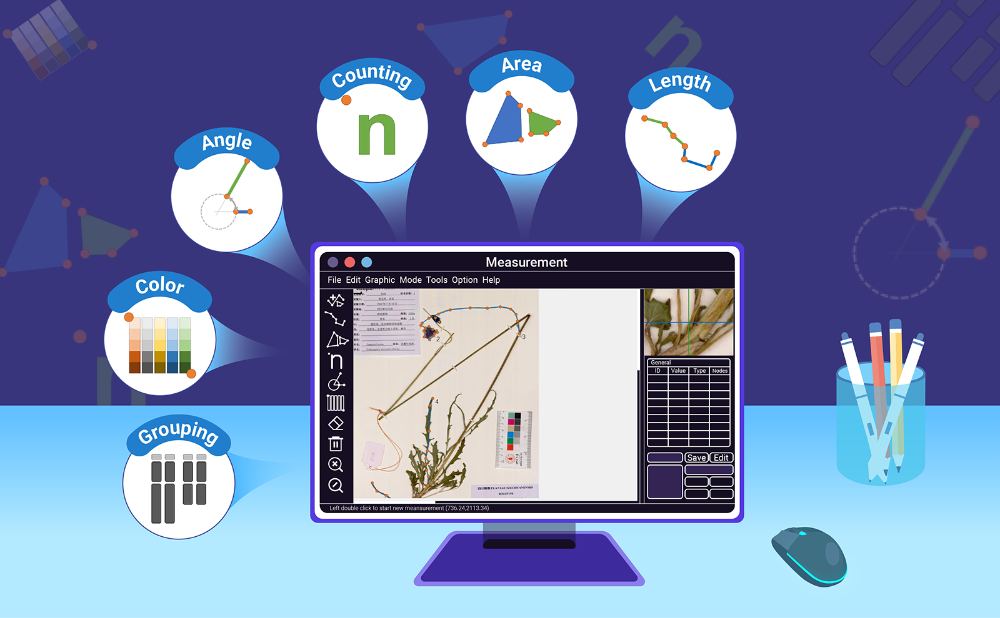

# MATO: Measurement and Analysis TOol

Advancements in bioinformatics and genomics have heightened the significance of cytotaxonomy and morphology as fields of study. The quantification of various characters forms the basis of morphological investigations. However, due to variations among characters across different taxa, manual measurements are commonly employed. Yet, existing measurement tools for morphology and cytotaxonomy lack repeatability and statistical analysis compatibility. To address these limitations, we have developed MATO (Measurement and Analysis tools) as an updated version of the KaryoType software. MATO aims to accelerate repetitive morphometric tasks and yield quantitative and reproducible outcomes. By introducing size-based Karyotyping and a novel grouping algorithm, MATO enhances chromosome measurements and karyotype analysis. Additionally, MATO encompasses a broad range of morphometric characters, including length, size, angle, count, and color, frequently utilized in plant taxonomy. MATO empowers researchers in the fields of cytotaxonomy and morphology by providing enhanced measurement capabilities, statistical analysis compatibility, and improved user-friendliness, facilitating advancements in their research endeavors.

随着生物信息学和基因组学的飞速发展，细胞分类学和形态学作为研究领域变得日益重要。多种特征的量化是形态学研究的基础。然而，由于不同物种间特征的差异性，通常需要手动测量。尽管如此，现有的形态学和细胞分类学测量工具在重复性和统计分析兼容性方面存在不足。为此，我们开发了MATO（测量与分析工具），作为KaryoType软件的更新版。MATO旨在加快重复性形态测量任务的速度，并提供定量且可重复的结果。通过采用基于尺寸的核型分析和创新的分组算法，MATO在染色体测量和核型分析方面有所提升。此外，MATO还能够进行各种形态特征测定，如长度、尺寸、角度、数量和颜色，这些在植物分类学中常用。MATO通过其增强的测量能力、统计能力以及更佳的用户体验，助力细胞分类学和形态学领域的研究者提升其工作效率。

# Cite 引用
Liu, L., Wang, Q., Zhang, Z., He, X. & Yu, Y. MATO: An updated tool for capturing and analyzing cytotaxonomic and morphological data. The Innovation Life. 2023. 1(1): 1-7. doi:10.59717/j.xinn-life.2023.100010

# Manual 操作手册 
- [English](./manual_en.pdf) 
- [中文](./manual_zh_cn.pdf)

# Download 下载 
Download the last release of MATO from [SourceForge](https://sourceforge.net/projects/karyotype/files/) or [Our Site](http://life-bioinfo.tpddns.cn:8445/database/app/MATO/)

MATO is distributed as a zip package. You just need to **unzip the zip package** to any location on your computer and double-click on the folder to run the program.

MATO下载后直接**解压缩**就可以运行，无需安装任何支持库。MATO只对64位版操作系统提供技术支持，如果需要在早期的32位操作系统上运行，请从源代码编译。

**For macOS**: MATO is packaged with Wineskin to run on macOS. Please try to use the latest version of MacOS. Due to limited conditions, MATO has not been tested on all macOS versions. If you meet error like "XXX is damaged" You can type this in terminal:
- xattr -cr /location_of_MATO.app
- Example: xattr -cr /Applications/MATO.app

**对于macOS**: 如果在运行时遇到“XXX已损坏”之类的错误，你需要打开终端，对MATO进行如下处理：
- xattr -cr /MATO所在位置
- 例如: xattr -cr /Applications/MATO.app
