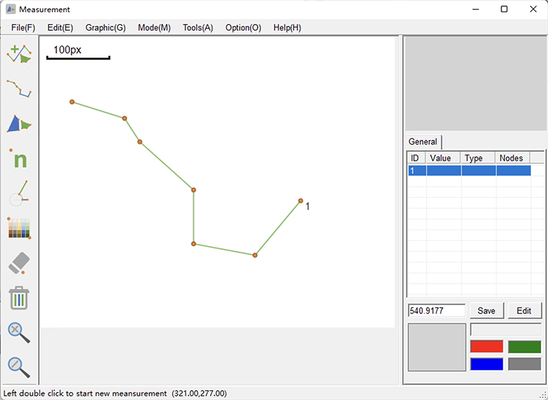

# MATO: A Measurement and Analysis TOol
The advances of the bioinformatics and genomics over recent years, and the growing importance of determining the relationships between structure and function, have made cytotaxonomy and morphology an increasingly important discipline. Quantitative determination of various traits is the basis for morphological studies. Due to diversity of traits in different taxa, many measurements must be performed manually. However, existing measurement tools for morphology and cytotaxonomy lack repeatability and not able to perform professional calculations and statistics. Here, we developed MATO (Measurement and Analysis tools), an update of previous software KaryoType, with the goal of accelerating repetitive morphometric tasks while also obtaining quantitative and reproducible results. MATO enhanced chromosome measurements and karyotype analysis from previous version by introducing size-based Karyotyping. . Additionally, MATO covers almost all the morphometric functions, including length, size, angle, count and color, for plant taxonomy. 

# Manual
[English](./manual_en.pdf) [中文](./manual_zh_cn.pdf)

# Install
Download the last release of MATO from [here](https://github.com/sculab/MATO/releases)

MATO is distributed as a zip package. You just need to **unzip the zip package** to any location on your computer and double-click on the folder to run the program.

**Windows**: Please make sure Microsoft® .NET 3.5 Framework or above have be installed on your computer. The .NET framework is part of Windows, but versions may vary from system to system. The .NET framework package is available for free on Microsoft's official website. Please install it before you use MATO to prevent it from not working. 

**MacOS**: MATO is packaged with Wineskin to run on macOS and supports both Intel CPU and M1. Please try to use the latest version of MacOS. Due to limited conditions, MATO has not been tested on all macOS versions.
